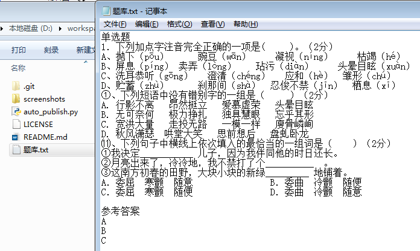
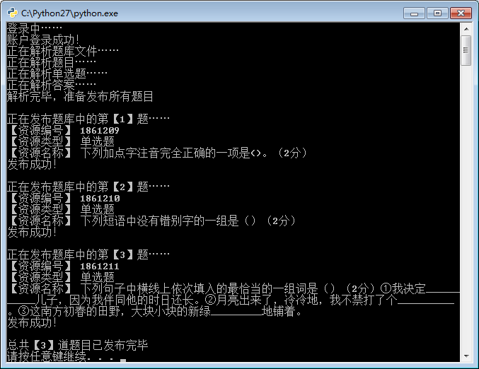
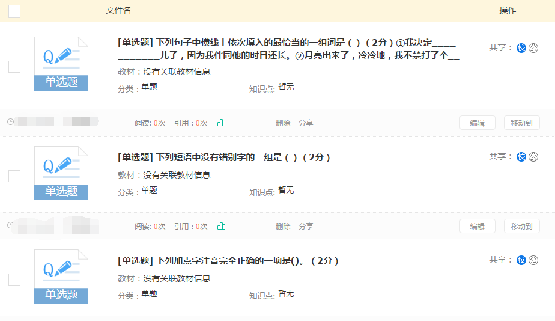

# Auto_publish
优学派电子书包教师端 试题批量发布脚本

## 简介
优学派电子书包是一个教师和学生互动的教育平台，老师在平台上出题，出试卷，学生可以在家里、在学校里任何地方，用手机、平板之类的设备登录自己的账号完成老师出的题。客观题会瞬间给出做题的结果，主观题由老师在后台批改。

程序用python2.7实现，**实现**不难：首先urllib模拟登录，然后chrome F12观察网络请求找到资源发布的url和post数据格式，最后抓取本地题库文件，解析出题目和答案信息，填写到post数据格式中，打包发送到url即可。

该程序**解决的问题**是：  
减少发布试题花费的时间。  
原因是优学派在后台出题的步骤上优化的不是很好，流程很麻烦，题量一多就要花费很多时间在题目发布上。  
具体有多浪费时间呢？老师一般在word上出好题，然后再一道题一道题and一个选项一个选项的复制到出题的表单中，然后挨个点击发布，有多少道题就要这样来回复制多少遍，选择题还要带上4个选项复制。   如此耗费了很多宝贵的时间，明明题目已经在本地上出好，还要花费大量时间在发布上，实在是得不偿失。    
如此耗费了很多宝贵的时间，明明题目已经在本地上出好，还要花费大量时间在发布上，实在是得不偿失。  
遂写了这个脚本来代替这些重复性劳动，在本地word上出好题，只需复制到txt文本文档中略作修改，运行程序就可以自动批量的发布试题了。

（ps：其实是帮老妈写的一个脚本，可以减轻她的工作负担 ≖‿≖✧）

## 如何使用
### step 1：下载项目，进入目录
`git clone https://github.com/windcode/Auto_publish.git`

### step 2：编辑auto_publish.py文件，填写登录用户名密码

### step 3：准备好题库文件，双击auto_publish.py运行

## 运行截图
正在批量发布题目到网站后台  

发布完毕，到后台查看发布结果  
  

刚才的三道题目已经成功发布到了网站后台中

## 注意
* 测试环境为windows（7和xp均已测试，可以正常运行）
